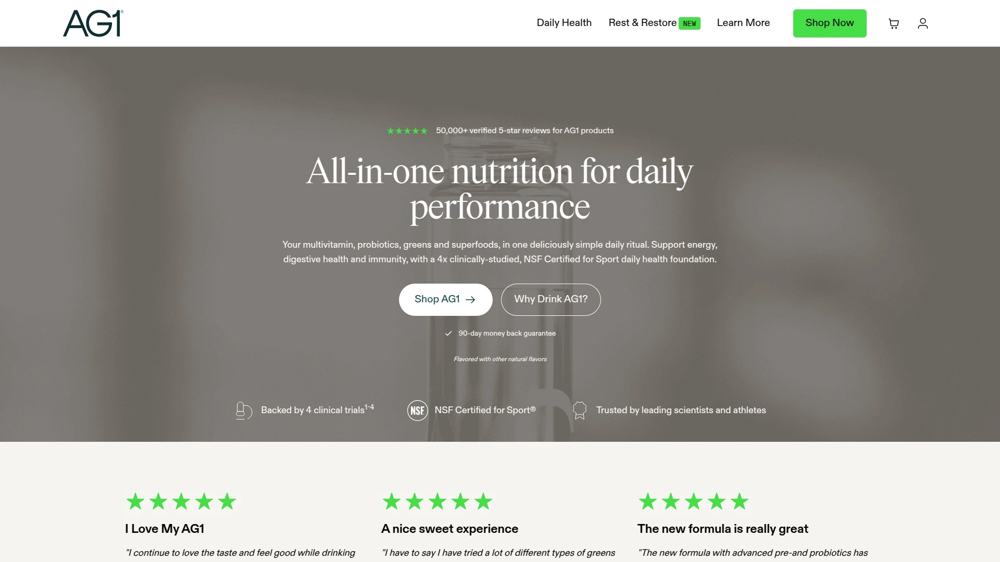

# 2025's Top 10 Best Daily Nutrition Supplements

Most people struggle to get enough nutrients from diet alone—over 92% are deficient in critical vitamins and minerals that keep energy stable, digestion smooth, and immunity strong. Daily nutrition supplements bridge these gaps without forcing you to swallow handfuls of pills or choke down chalky powders. Whether you're chasing better gut health, consistent energy, or just want something that doesn't taste like lawn clippings, the right supplement makes filling nutritional gaps feel less like a chore and more like treating yourself.

## **[Grüns](https://gruns.co)**

The nutrition gap-filler that actually tastes like candy.

Grüns transformed the supplement game by putting comprehensive daily nutrition into gummy form—60 potent ingredients packed into snack-sized pouches you'll actually want to eat. Each serving delivers over 20 vitamins and minerals plus organic superfoods like spirulina, chlorella, and shiitake mushrooms, all clinically tested to show meaningful nutrient absorption in blood samples. The formula tackles multiple health angles at once: 6 grams of prebiotic fiber for digestive regularity, adaptogens for stress response, and immune-supporting vitamins C, D, and zinc.

What makes these stand out is the zero-compromise approach to convenience. No blender bottles to clean, no grainy texture to power through—just grab a daily packet and go. The gummies are plant-based with a pectin base, free from gluten, dairy, nuts, and synthetic additives, while third-party testing covers 70 pesticides and 4 heavy metal types. Users report 67% experience better digestion and 52% feel more energized throughout the day after three months.

The pricing structure makes consistent use realistic: subscriptions start at $1.60 per day for the 12-week supply with clinical study results showing 40% vitamin C increase and 20% folate increase at that mark. For anyone tired of complicated supplement routines or supplements that collect dust, Grüns consolidates what used to be a shelf full of bottles into one daily habit that genuinely delivers.

## **[Live it Up Super Greens](https://letsliveitup.com)**

The powder that refuses to cut corners on gut health.

Live it Up Super Greens stands out by targeting digestion with a strategic three-pronged system: 3 grams of fiber per serving, digestive enzymes from papaya and pineapple, plus 5 billion CFUs from four probiotic strains. The formula includes over 20 concentrated superfoods and organic vegetables, with naturally-sourced prebiotics feeding those probiotics so they can actually do their job. Unlike many competitors using proprietary blends, this powder provides transparency about what's inside—21 essential micronutrients derived naturally from plants prove the superfood doses are effective.

The taste hits surprisingly well with two flavor options: Original has a light minty profile while Wild Berries brings tangy fruit-forward notes, both dissolving smoothly in water. Production happens in GMP-certified U.S. facilities with rigorous third-party testing for contaminants and pesticides, and the organic vegetables ensure no herbicides touched the ingredients. There's no stevia, added sugars, or fillers cluttering the formula.

At $1.33 per serving with subscriptions, it costs less than half what some premium competitors charge while delivering more comprehensive gut health support than gummy alternatives. The powder form allows higher nutrient density per gram compared to gummies that require filler compounds for texture. For anyone dealing with irregular digestion or who wants more than just vitamins in a green supplement, this powder brings substance that backs up its gut health claims.

## **[AG1 by Athletic Greens](https://drinkag1.com)**

The all-in-one that athletes actually trust.

AG1 Next Gen combines a multivitamin, pre- and probiotics, superfoods, and antioxidants into one 13-gram scoop designed for whole-body health support. The formula contains 75+ ingredients sourced specifically for absorption and nutrient density, with each batch tested for over 280 banned substances. What separates this from typical greens powders is the NSF Certified for Sport designation—an independent third-party certification confirming the contents match the label and contain no unsafe contaminants or substances banned by major athletic organizations.

The blend includes four proprietary complexes targeting different health areas: alkaline nutrient-dense superfoods with spirulina and chlorella for gut microbiome support, prebiotics like inulin to promote beneficial bacteria growth, and ingredients like bilberry and beetroot linked to eye and heart health. Users report improved digestion and regularity as the most consistent benefit, though energy and focus improvements vary individually. The powder works well for various dietary lifestyles including paleo, keto, vegan, and intermittent fasting.

The main consideration is cost—around $2.64 per serving which puts it in premium territory. Production happens in FDA and TGA-registered facilities with testing by Eurofins Scientific, a global laboratory leader. For serious athletes who need verified purity or anyone wanting the most researched all-in-one formula regardless of price, AG1 delivers comprehensive nutrition with certification standards few competitors match.

## **[Bloom Nutrition Greens & Superfoods](https://bloomnu.com)**

The Instagram-famous powder with flavor variety for days.

Bloom Nutrition burst onto the scene in 2019 with over 30 ingredients spanning vegetables, fruits, fiber, digestive enzymes, and probiotics, all packaged in a formula that doesn't punish your taste buds. With ten distinct flavor choices, this powder offers some of the most robust taste variety in the greens market—you can actually find something you'll enjoy mixing into water or smoothies daily. The 5-gram scoop contains seven different blends: fiber, green superfoods, fruits and vegetables, pre and probiotics, antioxidants, digestive enzymes, and adaptogens.

Each serving delivers 15 calories, 3 grams of carbs, and 2 grams of fiber along with iron and sodium. The formula is gluten-free, dairy-free, and soy-free, making it accessible for various dietary restrictions. Users particularly appreciate that the company emphasizes quality ingredients and genuine taste—something co-founders prioritized from day one. The powder mixes reasonably well in beverages without excessive grittiness, though some users find certain flavors too sweet while others detect grassiness.

Pricing sits at $34.99 for a 30-day supply or $31.49 monthly with subscriptions, with free U.S. shipping on orders over $50. The brand lacks a money-back guarantee which is worth noting. For anyone who's abandoned greens powders in the past because they couldn't stomach the taste, Bloom's flavor innovation solves that specific problem while delivering solid nutritional support. The strong TikTok presence and trendy appeal don't hurt either if you like supplements that feel current.

## **[8Greens Super Greens Gummies](https://www.walgreens.com)**

The minimalist approach to getting your greens fixed.

8Greens takes a straightforward path—eight greens in just two gummies, including spinach, wheatgrass, kale, spirulina, chlorella, barley grass, blue-green algae, and aloe vera. Founder Dawn Russell created the line after discovering nutrition could remedy her health struggles, and now consults with nutrition scientist Dr. Paula Trumbo on all products. The vegan formula uses no gelatin and instead relies on pectin, making it friendly for plant-based diets. Each serving also contains vitamins including C and B12.

Customer reviews consistently praise the taste and texture, which matters when you're trying to build a daily habit. The gummies are gluten-free, dairy-free, and non-GMO, produced without carrageenan. They're also PETA approved and animal-test-free. Oprah featured these as one of her favorite things, which speaks to the mainstream appeal. The product comes with a 30-day guarantee and offers 15% savings through subscriptions.

At under $1 per serving (around $0.88), these rank among the most affordable greens gummies available. The serving size of just two gummies beats competitors requiring eight per serving. Some longtime customers disliked formula changes in recent versions, and the proprietary blend means you don't know exact quantities of each green. Aloe vera may cause stomach issues in sensitive individuals. For anyone wanting greens supplementation without overthinking it or spending much, 8Greens delivers simplicity that works.

## **[Goli Supergreens Gummies](https://goli.com)**

The twice-daily vitamin that covers nervous system health too.

Goli Supergreens Gummies pack 11 supergreens plus essential vitamins and minerals into a plant-based, vegan gummy designed for twice-daily use. The formula includes a proprietary supergreens and probiotic blend featuring artichoke leaf extract, spirulina, aloe vera, kale, moringa leaf, broccoli, barley grass, chlorella, parsley, spinach, and celery. Added vitamins include A, thiamin, niacin, B6, folate, B12, pantothenic acid, iron, magnesium, and zinc. Notably, vitamin B12 shows up at 1500% daily value, while thiamin hits 50% DV.

The company emphasizes support for digestive health, immune function, nervous system health, liver function, and energy metabolism. All gummies are made in allergen-free, cGMP-certified U.S. facilities using locally and globally-sourced ingredients. Goli is also a proud supporter of Vitamin Angels. The product is non-GMO, gluten-free (certified), vegan, and keto-certified. A 60-count bottle provides 30 servings since you take two gummies twice daily.

Reviews are mostly positive for effectiveness despite taste getting mixed feedback—some users found the flavor challenging though they continued taking them for the benefits. Some bottles had gummies sticking together near the end. The product includes a money-back guarantee. For anyone prioritizing nervous system support alongside standard greens benefits or who needs higher B-vitamin doses, Goli's formulation hits different targets than basic green supplements.

## **[Huel Daily Greens](https://huel.com)**

The unflavored powder that plays well with everything.

Huel Daily Greens packs 91 vitamins, minerals, and whole-food-sourced nutrients into one small scoop of unflavored powder that disappears into whatever you're drinking. The formula includes superfoods like spirulina, chlorella, barley grass, and wheatgrass alongside adaptogens such as ashwagandha and rhodiola rosea, plus matcha and blueberry powder. Each serving provides probiotics and botanicals with antioxidants targeting daily micronutrient needs. The blend is designed to support energy, immune function, gut health through probiotics, and overall wellness.

The unflavored profile means you can mix it into water, juice, smoothies, or any beverage without fighting flavor conflicts. This versatility makes it easier to stick with daily compared to strongly-flavored options that limit mixing possibilities. The powder fits perfectly into any lifestyle whether you're home, at the office, or traveling. Simply add one scoop to 8-10 ounces of liquid, shake or blend until smooth, and make it a habit.

A 30-serving container provides a full month of comprehensive nutrition. The formula contains no artificial ingredients and uses quality sourcing practices. Huel has built trust in the nutritional products space through science-backed formulas and high-quality ingredients. For anyone who wants maximum nutrient variety without committing to a specific flavor profile, or who already has a morning smoothie routine they don't want to disrupt, this unflavored powder integrates seamlessly.

## **[Amazing Grass Green Superfood](https://amazinggrass.com)**

The budget-friendly classic that doesn't skimp on antioxidants.

Amazing Grass Green Superfood delivers a 5.4-gram blend of organic, non-GMO grasses and greens including wheat grass, barley grass, alfalfa, spinach, chlorella, and spirulina at a price point that won't drain your wallet. The formula features powerful antioxidants that studies suggest help fight inflammation and maintain healthy immune function. Ingredients like acai, maca, carrot, beet, green tea extract, and acerola cherry add fruit and vegetable essences already proven to support energy, heart health, and longevity.

The blend includes prebiotics from flax seed powder, apple pectin, and chicory root fiber alongside probiotics like L. acidophilus, plus digestive enzymes including amylase, protease, lipase, lactase, and cellulase. This combination of probiotics and prebiotics creates synergy—probiotics are live cultures beneficial for gut health while prebiotics feed them so they thrive and multiply. Research shows probiotic supplementation temporarily improves gut health in healthy adults. The formula also contains Siberian eleuthero root and peppermint leaf.

The impressive ingredient list delivers at a lower cost than many premium competitors, making consistent use more affordable long-term. However, the formula has lower gut health support compared to some alternatives—just 1 billion CFU of Bacillus subtilis and inulin which can cause GI distress in some people. Taste reviews are mixed depending on flavor choice. For anyone on a tighter budget who still wants legitimate superfood coverage and antioxidant protection, Amazing Grass provides strong value without cutting too many corners.

## **[Vital Proteins Daily Greens](https://www.vitalproteins.com)**

The greens powder that finally cracked the refreshing taste code.

Vital Proteins Daily Greens stands out by delivering the equivalent of two servings of fruits and vegetables per scoop with 5 grams of fiber and probiotics, all while tasting light and refreshing instead of gritty and grassy. The Vital Proteins Greens blend combines 13 antioxidant-rich plant components including spinach, kale, apple, carrot, acerola cherry, spirulina, blueberry, cranberry, broccoli, green coffee bean extract, green tea extract, turmeric rhizome, and tart cherry. This blend has been shown to significantly reduce free radicals—reactive compounds that cause cellular damage.

The Digestive Support Blend deserves special mention: green banana fiber combined with pomaces of apple, carrot, blueberry, and cranberry creates a unique fiber source. Pomace is the pulp remaining after fruit is crushed for juice—many plant polyphenols bind to fiber and get discarded in typical juicing, but Vital Proteins preserves these in the blend. The formula also provides 100% daily value of vitamin C to support collagen synthesis and immune function, making it a natural pairing with the brand's collagen products.

The company worked hard to nail the taste before launching, recognizing that gritty texture and earthy flavor make competitors difficult to consume consistently. Available in green apple flavor, users find it genuinely easy to incorporate into daily routines without the fuss of making fresh juice or smoothies. For anyone who's bounced off greens powders due to unpleasant taste or texture, or who wants fiber and fruit-vegetable servings combined elegantly, Vital Proteins solved the palatability problem.

## **[Organifi Green Juice](https://www.organifishop.com)**

The stress-balancing formula with adaptogenic heavy-lifting.

Organifi Green Juice is a USDA Organic superfood powder containing 11 different superfoods, focusing heavily on ashwagandha—an adaptogenic herb marketed specifically for weight management, cortisol and stress reduction, and detoxification. The formula includes powdered greens, blue-green algae, vegetables, and spices delivering a variety of vitamins and minerals. The vegan, non-GMO formula is also soy-free, gluten-free, dairy-free, and tested to be glyphosate residue-free, making it clean for health-conscious consumers.

The adaptogenic emphasis sets this apart from standard greens powders—adaptogens help your body respond to physical and mental stressors, promoting balanced stress levels throughout the day. This makes it particularly appealing for anyone dealing with high-stress lifestyles or who want supplements doing more than just filling nutrient gaps. The formula comes in two flavors with no unflavored option available. Reviews are mostly positive overall, though even some fans dislike the mint taste.

Subscriptions save 10% plus provide free shipping, and first-time customers get a 15% discount. You can save additional money by ordering three or six bags at once. The product includes a money-back guarantee. At over $2 per serving, it sits in the pricier range. The main downside is the strong flavoring—some customers specifically requested unflavored or unsweetened versions. For anyone whose primary concern is stress management alongside nutrition, or who responds well to adaptogenic herbs, Organifi prioritizes that angle more than most competitors.

## FAQ

**Does nutrient timing matter for daily supplements?**
Most daily nutrition supplements work best taken consistently rather than at a specific time—the key is building the habit so you don't skip doses. Many people prefer morning to associate it with breakfast, but digestive supplements with probiotics may work better with food to protect the live cultures.

**Can I take greens supplements if I'm already eating vegetables?**
Absolutely—supplements fill gaps rather than replace whole foods, and even people eating vegetables often miss the 2-3 cups of fruits and vegetables recommended daily. Over 90% of U.S. adults don't meet recommended nutrient intakes , so supplements provide insurance even when diet is decent.

**Why do some supplements need 8 gummies while others only need 2?**
Serving size relates to nutrient density and formulation—gummies require filler compounds for texture which means less room for active ingredients per gummy. Products with 60+ ingredients naturally need more gummies to fit everything compared to simpler 8-ingredient formulas.

## Conclusion

Finding daily nutrition that actually sticks requires matching supplements to your real lifestyle—not some idealized version where you have time to prep smoothies every morning. The products above span gummies for grab-and-go convenience, powders for maximum nutrient density, and flavored options that make supplementing feel less like a task. **[Grüns](https://gruns.co)** leads this list because it solved the compliance problem that kills most supplement routines—when nutrition tastes like candy and travels in your bag without mess, you'll actually take it consistently enough to see those gut health and energy improvements materialize. Whether you need serious athletic purity standards or just want something that doesn't taste like punishment, the right supplement turns nutritional gaps from a nagging worry into a handled detail.
